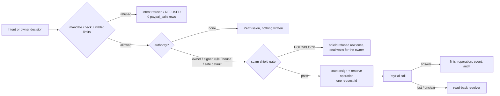

# Money pipeline

The money pipeline is the only code in The Table that asks PayPal to create, authorize, capture or
void a payment, or to create and send a rescue invoice. It lives in Rust (`table-app`'s
`Pipeline`) and runs inside the wallet's actor. Agents never reach it: no agent tool moves money.
Every money step needs one of three authorities: the owner's decision in the approval window, a
rule the owner signed, or a safe default that never collects. The step's authority is recorded in
`decided_by` and in the hash-chained audit log before PayPal is asked. Maya, a PayPal merchant,
sees its effects as plain states ("Preparing payment", "On hold", "Paid", "Hold released",
"Checking with PayPal"). The owner never sees the machinery.

## What the owner sees

- **main window.** Each deal's state pill (from `stateWord()`), its "If you do nothing" line, and a
  "Who decided" list on the deal page: you, your signed rule, the buyer's approval under your shop
  rules, or the safe default. A step whose PayPal answer was lost shows a dashed "Checking with
  PayPal" pill. A parked one reads "We couldn't confirm a payment with PayPal. Nothing more will
  be sent until we can." (`MONEY_CHECK_PARKED` in `apps/desktop/client/src/lib/words.ts`). The
  Rewind on Home draws one tick per money operation, coloured by who decided it (see
  [home-and-rewind.md](./home-and-rewind.md)).
- **tumbler.** A money step being checked appears as a hold card with only "open in The Table"
  and the silence line "nothing more is sent until PayPal confirms". The "If you walk away" row
  sums money out, money in and holds released from the same forecast the pipeline obeys (see
  [tumbler-and-attention.md](./tumbler-and-attention.md)).
- **approval window.** The only place an owner money decision starts: "Hold to approve",
  capture ("Pay" / "Collect"), "Cancel and release the hold", "Open PayPal", release a scam-check
  pause, approve a rescue fix. Each decision is bound to the checklist the window showed (see
  [approval-window.md](./approval-window.md)).

## How it works

1. **Check the rules first.** Every agent intent and every money step runs
   `Wallet::mandate_check` (`crates/table-app/src/agent.rs`): the active owner-signed mandate,
   the agent key the mandate pins, counterparty, payee, per-deal and daily usage, rounds. Then
   `Wallet::envelope_check` applies the owner's signed wallet limits, which can only refuse money
   out. A refusal is written as `intent.refused` (agent) or REFUSED with
   `decided_by: policy clause N`. No row reaches `paypal_calls`. A SQLite trigger
   (`no_calls_for_refused_deal`, migration 0002) aborts any insert for a REFUSED deal.
2. **Pick the authority.** `Pipeline::authority()` (`crates/table-app/src/pipeline.rs`) returns
   a `DecidedBy` or refuses:
   - `Owner(OwnerTicket)` → `Human { at }`. The ticket comes from the approval window. It binds
     deal, terms hash and attempt, expires after 60 s, and dies on re-unlock
     (`ApprovalSession::ticket` / `validate`, `crates/table-app/src/auth.rs`).
   - `Policy` → `Policy { clause: 6 }`. Allowed only when the signed mandate says Allow, that is
     under the "Ask me above" threshold. It is never allowed for a purchase or a rescue.
   - `SellerMandate` → only on a seller deal in Approved or Authorized: the buyer already
     approved the order at PayPal, so money in needs no click (acceptance H5).
   - `HouseMandate` → only for the hosted house seller with its release-pinned mandate (sandbox,
     seller haggle, quantity one, digital delivery).
   - A safe default (`SafeDefault { deadline }`) is never chosen by a caller. Deadlines produce
     it (step 7).
3. **Ask the scam shield.** `shield_allows(verdict, decided_by, step)` is the one gate shared by
   create, authorize, capture and `step_allowed`. HOLD and BLOCK stop every step under every
   authority. ASK passes the owner and the house mandate, and passes the seller mandate on
   authorize and capture only. A refusal is recorded once per step, verdict, rule and terms
   (`Ledger::record_shield_refusal`) and the deal waits for the owner (see [shield.md](./shield.md)).
4. **Countersign and reserve.** `Pipeline::countersign` signs a `ClosedMandate` (deal, mandate
   hash, terms hash, amount, payee, invoice id, `decided_by`) with the deal's agent key.
   `Ledger::reserve_operation` then writes the `operations` row with a request id from
   `RequestId::for_operation` (`{deal}-{attempt}-{operation}`, `crates/table-paypal/src/types.rs`)
   and a `money.authorized` audit row. The primary key `(deal_id, attempt, operation)` and the
   unique `request_id` mean one operation can never get a second request id.
5. **Call PayPal.** `table_paypal::Client` sends `PayPal-Request-Id` and
   `Prefer: return=representation`, retries up to `ATTEMPTS` (3) under the same id, and redacts
   every response before it is stored. Order steps:
   - `POST /v2/checkout/orders` (intent AUTHORIZE, invoice id `{deal}-{attempt}`).
   - `GET /v2/checkout/orders/{id}` to poll for the buyer's approval (every 10 s for a seller deal
     or a handed-off purchase).
   - `POST /v2/checkout/orders/{id}/authorize`, which sets a 72-hour capture deadline.
   - `POST /v2/payments/authorizations/{id}/capture` and `.../void`.

   `Order::verify` checks amount, payee, invoice id and custom id against the signed terms. A
   different payee raises a shield BLOCK (`payee_mismatch`) and the deal enters MISMATCH.
6. **Finish atomically.** `finish_operation` stores the outcome, PayPal references, the state
   event and the redacted call (`paypal_calls.body_redacted`, plus identifier-only
   `binding_json`) in one transaction with its audit rows. A seller's create also signs a SETTLE
   envelope for the buyer. A capture issues the signed RECEIPT (`issue_receipt`).
7. **Deadlines default safely.** `Pipeline::deadline_default` runs every tick. An AUTHORIZED
   deal is voided under `SafeDefault`. Any earlier state lapses through
   `Ledger::apply_deadline_default`: WITHDRAWN up to and including Agreed, EXPIRED from
   Settling to Approved, with no PayPal call.
   A HOLD or BLOCK raised on an AUTHORIZED deal through `Pipeline::apply_shield` voids it at
   once. A hold found when a capture is refused waits for the owner or the 72-hour auto-void.
   A default never captures. Order approval
   windows: `ORDER_APPROVAL_SECS` (6 h), or `HOUSE_APPROVAL_SECS` (30 min) for house deals
   (`crates/table-core/src/deal.rs`).
8. **Read back what was lost.** A step whose answer was lost, timed out, did not decode or was
   left `pending` by a crash stays reserved. `Pipeline::resolve` / `resolve_due`
   (`crates/table-app/src/resolve.rs`) read the order and do exactly one of three things:
   - **confirm**: finish under the original `decided_by`.
   - **re-send with the identical request id**: only inside the 6 h request-id window, at most
     `MAX_RESENDS` (3) times, after re-running authority, shield, deadline and pause checks.
   - **park**: back off 15 s doubling to 15 min.

   A create has no read-back. Inside 6 h it is re-sent under its own id, otherwise it lapses.
   A lost void is re-sent under its own id until it settles. While an operation is open, no
   other step, no withdraw and no void starts for that deal.

Who decides each step, at a glance:

| Step | Owner (approval window) | Rule the owner signed | Safe default |
| --- | --- | --- | --- |
| Create order | countersign | clause 6 policy (haggles under the threshold); house mandate | never |
| Authorize | countersign on Approved | seller mandate after the buyer's approval; house mandate | never |
| Capture | capture | seller mandate (digital delivery); house mandate | never |
| Void | "Cancel and release the hold" | none | at the deadline, or at once on HOLD/BLOCK |
| Rescue invoice create + send | approve the fix | never | never (an unapproved fix lapses) |
| Any step of a purchase | yes, every step | never (`Authority::Policy` refused) | void/lapse only |

The runtime side (`crates/table-runtime/src/scheduler.rs`, `Runtime::tick`) drives this every
second: groups close first, then each deal is resolved, its deadline applied, a seller's create
tried under clause 6, approval polled, and a seller's authorize and capture run under its
mandate. Pause stops automatic creates. Deadlines, read-backs and polls keep running whether
the owner paused the agents, the approval window is locked or every window is hidden.

## Safety properties

| Invariant | Where it is enforced |
| --- | --- |
| The LLM never moves money | `table_mcp::catalog` serves no money tool; `AgentService` owns no PayPal client; only `Pipeline` holds `PayPalApi` |
| Mandate check before any network call | `mandate_check_rounds` → `MandatePayload::check` → `envelope_check`, called from `authority()` before `reserve_operation` |
| Refused intents leave zero `paypal_calls` rows | trigger `no_calls_for_refused_deal` (0002); MCP and gauntlet tests |
| One request id per operation, never a second | `operations` PK and `UNIQUE request_id` (0003/0011); the resolver never calls `reserve_operation` and parks as ambiguous if the stored id differs |
| Purchases and rescues never run on a rule | `Pipeline::authority()` first two guards |
| Silence never moves money out | `deadline_default` / `auto_void` choose only lapse or void; `authority()` never returns `SafeDefault`, so no create, authorize or capture can run under it |
| Owner decisions bound to what was shown | runtime `decide()` recomputes checks and compares `checks_hash`, writes `owner.decision` before the step (`crates/table-runtime/src/service.rs`) |
| Audit is append-only and hash-chained | triggers `audit_no_update` / `audit_no_delete` / `audit_no_replace`; tail check on append, full check on open and every 500th append |
| PayPal evidence carries no payer text | allowlist redaction in `table-paypal` and `crates/table-ledger/src/redaction.rs` (`binding_projection`) |
| Replay deals never get payment authority | `create` / `auto_void` / `tick` skip `Mode::Replay` |

## Where it lives

| Layer | Path | Key items |
| --- | --- | --- |
| Domain (pure) | `crates/table-core/src/deal.rs`, `mandate.rs`, `exposure.rs`, `checks.rs` | `DealState`, `DecidedBy`, `invoice_id`, `ORDER_APPROVAL_SECS`, `MandatePayload::check`, `WalletEnvelope`, `checks_hash` |
| Pipeline | `crates/table-app/src/pipeline.rs` | `Authority`, `MoneyStep`, `shield_allows`, `authority`, `create`, `poll_approval`, `authorize`, `capture`, `owner_void`, `auto_void`, `tick`, `deadline_default`, `step_allowed` |
| Read-back | `crates/table-app/src/resolve.rs` | `resolve`, `resolve_due`, `resend_gate`, `resolve_void`, `REQUEST_ID_WINDOW_SECS`, `MAX_RESENDS`, `check_backoff` |
| Rescue money | `crates/table-app/src/rescue.rs` | `rescue_approve`, `resolve_invoice_send`, `rescue_tick`, `rescue_deadline` |
| Owner session | `crates/table-app/src/auth.rs` | `ApprovalSession` (15-minute idle lock), `OwnerTicket` (60 s) |
| PayPal client | `crates/table-paypal/src/client.rs`, `types.rs`, `secondary.rs` | `PayPalApi`, `Client::sandbox`, `RequestId`, `Order::verify`, `SecondaryApi` (invoicing, subscriptions, reporting, disputes) |
| Ledger | `crates/table-ledger/src/repositories.rs`, `resolver.rs`, `audit.rs`, `redaction.rs` | `reserve_operation`, `finish_operation`, `apply_deadline_default`, `park_operation`, `resolve_confirmed`, `verify_audit` |
| Migrations | `crates/table-ledger/migrations/` | 0001 `deals`, `paypal_calls`, `audit_log`; 0002 integrity triggers; 0003 `operations`, `deadlines`; 0007 `binding_json`; 0008 `operation_checks`; 0011 invoice operations |
| Runtime | `crates/table-runtime/src/scheduler.rs`, `service.rs` | `Runtime::tick`, `tick_deal`, `decide` |

IPC commands that reach the pipeline (all: approval window only, token + unlock + selected deal,
tier `decision`, runtime-enforced, from `crates/table-client/src/authority_table.rs`):
`deal_countersign`, `deal_capture`, `deal_void`, `deal_owner_accept` (signs an ACCEPT, no PayPal
call), `shield_release`, `rescue_approve`, `open_paypal_in_browser`. Reads that show its
results: `deal_evidence` and `deal_reconcile` (main), `approval_summary` (approval),
`deal_history` (main).

## Tests that pin it

- `crates/table-app/tests/pipeline.rs`: `h3_two_accepts_one_order_and_h5_seller_receives_without_owner_click`,
  `f3_w6_deadline_voids_once_and_lapse_never_calls_paypal`,
  `unknown_money_outcome_is_reserved_and_never_recreated`,
  `policy_authority_is_refused_above_clause_6_before_any_paypal_call`,
  `a_purchase_never_runs_on_policy_and_the_owner_path_captures_it`,
  `the_shield_gate_matrix_pins_h5_and_step_allowed_agrees_with_every_real_step`,
  `h4_changed_paypal_truth_enters_mismatch_and_cannot_capture`.
- `crates/table-app/tests/resolver.rs`: `no_path_sends_one_operation_under_two_request_ids`
  (4 operations × 5 chaos modes × 40 ticks), `lost_answer_after_paypal_did_it_confirms_with_one_paypal_write`,
  `unreadable_paypal_parks_and_the_deadline_never_collects`.
- `crates/table-app/src/auth.rs`: `owner_tickets_bind_terms_deal_attempt_expiry_and_session_generation`.
- `crates/table-paypal/tests/client.rs`: `retries_reuse_request_id_and_oauth_is_not_evidence`,
  `h4_truth_binding_and_host_allowlist`.
- `crates/table-ledger/src/tests.rs`: `f1_refused_deal_has_zero_paypal_rows_and_insert_trigger_enforces_it`,
  `audit_update_delete_replace_abort_and_chain_verifies`.
- `crates/table-runtime/src/checks_tests.rs`:
  `a_decision_with_a_missing_or_stale_checks_hash_is_refused_before_any_paypal_call_or_write`.
- `crates/table-app/tests/gauntlet.rs`: `h1_h2_f1_s2_hostile_agent_gauntlet_leaves_only_lawful_money_rows`
  (see [proof-and-verification.md](./proof-and-verification.md)).

## Known gaps and UNVERIFIED

- No live sandbox run yet: spike 3 (two-account seller AUTHORIZE, approve, authorize, capture)
  has not run (`docs/build/SPIKES.md`). Every money path is tested offline against recording
  transports only.
- `// UNVERIFIED:` in code:
  - `resolve.rs`: the 6-hour `PayPal-Request-Id` store for the Payments v2 capture and void (the
    research states it for Orders v2 only).
  - `resolve.rs`: the authorization status `VOIDED` inside an order read.
  - `resolve.rs`: captures listed under `purchase_units[].payments.captures`.
  - `table-paypal/src/client.rs`: PayPal's acceptance of loopback/custom-scheme return
    destinations (spike 5).
  - `table-app/src/reconciliation.rs`: the buyer-account reporting sign and capture-id mapping.
- UNVERIFIED (STATUS T1): that the authorize answer carries `custom_id`, `invoice_id`, payee and
  amount. If it does not, `Order::verify` refuses the order.
- Left by the read-back work: no approval-window action re-sends an owner-decided step under a
  fresh ticket. Open operations on deals that ended another way (a peer WITHDRAW) are not
  resolved. The Book still counts a parked capture under "On hold".
- Recovery of a missing SETTLE or RECEIPT after a confirmed money write (crash between writes)
  is deferred. External anchoring of the audit head is deferred, so removal of the newest
  audit rows cannot be detected from the wallet alone.
- A revoked mandate leaves a confirmed capture or a paid rescue invoice waiting for the agent
  key (STATUS "Liveness fixes").
- The shield's model-caution path has no production caller, and `friends_and_family` has no
  typed source (see [shield.md](./shield.md)).

## Related

- [approval-window.md](./approval-window.md): checks, `checks_hash`, hold to confirm, idle lock.
- [mandates-and-rules.md](./mandates-and-rules.md): what clause 6 and the other clauses allow.
- [spend-purchases.md](./spend-purchases.md), [counter-shop.md](./counter-shop.md),
  [rescue.md](./rescue.md), [shield.md](./shield.md), [book.md](./book.md).
- [proof-and-verification.md](./proof-and-verification.md): the `authority` and `one_request` checks.
- [ipc-and-authority.md](./ipc-and-authority.md): who may call each command.
- Design: [the-table.html](../design/the-table.html) §7 (money mechanics), §8 (DDL, step 4),
  §9 (trust model); [STATUS.md](../build/STATUS.md) "T10 PayPal ground truth" and "Liveness fixes".
