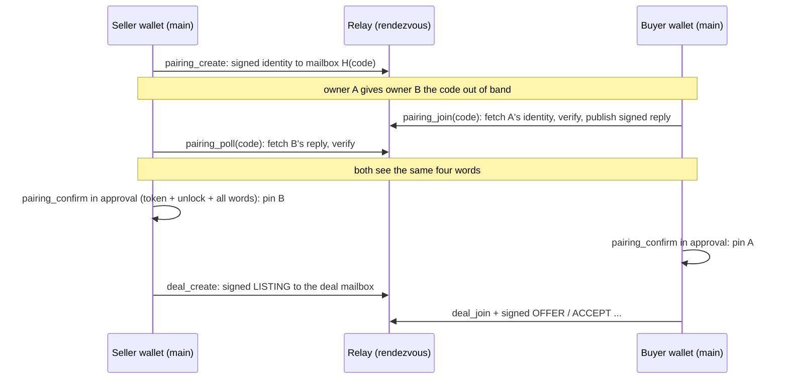

# Pairing, relay and the house seller

Two wallets that want to deal first connect ("pair"). One owner shares a short code, the other
types it, and both confirm the same four words in their own approval window. After that, every
message between the two agents is a signed envelope that travels through a small relay
(rendezvous) that holds no keys and reads nothing. The house seller is a practice shop run by The
Table's release owner: a hosted wallet with its own signed rules, always open, that any fresh
install can pair with and buy from in the PayPal sandbox. It publishes a signed public record of
everything it did, a scoreboard page anyone can open, and heads a buyer's wallet keeps as a
witness. Pairing and relay move no money. The house seller moves money only under its
release-pinned mandate, through the same money pipeline as any wallet.

## What the owner sees

- **main window, Settings › Connections, pairing desk** (`windows/main/setup/PairingDesk.tsx`):
  - Three ways in: "Share a code", "I have a code", "House seller" ("A practice shop that is
    always there").
  - Sharing shows the code with Copy, "Code works …" with "Stop waiting", and "If you do
    nothing" (the code expires).
  - The house shows its state ("Waking up…", "Wake it now", "Connect with the house").
  - When the other side answers, "Four words appear here", then a hand-off: "The approval
    window is open. Confirm the words there."
  - Ending a pairing reads "Stopped. Nobody was connected and no money moved."
- **approval window, confirm words** (`windows/approval/PairingConfirm.tsx`): the four words to
  tick ("Tick all four words first"), a name only the owner sees, and "Unlock with Windows Hello".
  For the house: "Connect the house seller? Check four words on its page first." "They differ:
  abort" ends it in Rust ("Nothing touched PayPal. Nobody was paid and no deal started.").
- **main window, Tables and deal page:** the counterparty by the owner's own label, with a
  pairing status of verified, house seller, or "Unpaired counterparty". The other side's free-text
  note is shown only on main, in a quarantined "note ›" view, never as an instruction and never
  in the Tumbler.
- **deal page, proof tab:** a "House seller's record" card for a house purchase. Warning states
  put a chip on "Proof from PayPal", for example "The house's record got shorter since your
  receipt. No money moved. Keep your signed proof…" (`houseRecordWord`).
- **House errors in plain words:** "The house is full right now", "The house has hit its limit
  for today", "The house turned this table down", each with "No money moved". "The house is
  waking or could not be reached" comes with "Try again; nothing is lost".
- **The scoreboard** (`GET /house` on the hosted service), for judges with no desktop app. Tiles
  show deals today, median discount off the ask, requests turned away with 0 PayPal calls, and
  entries in the signed record. Eight checks re-run in the browser. "Check it yourself" offers
  downloads and the `table-verify` command.

## How it works

1. **Create.** `pairing_create` (main) draws a 128-bit code (`PairingCode::from_entropy`). It
   signs a `SignedPairingIdentity`: owner and agent keys, code hash, side, payee and expiry,
   signed by both keys (`crates/table-proto/src/pairing.rs`). The identity is published to the
   mailbox `H(code)` when a relay is attached.
2. **Join.** `pairing_join` (main) with `{code, side, payee}` discovers that identity by code. It
   verifies signatures, code, opposite side, expiry and the JWS type, then publishes a signed
   reply that commits to the whole initiating identity. It returns the four words:
   `pairing_words(buyer, seller, code)` picks four words from a fixed 64-word list, buyer then
   seller. Echoes, malformed packets and conflicting replies fail closed.
3. **Poll.** The creator's `pairing_poll` (main) returns the words once the reply arrives (null
   until then). After relay loss it re-publishes the same offer.
4. **Confirm.** `pairing_confirm` (approval, token + unlock) needs all four words. It pins the
   peer's identity and declared payee and the shared mailbox seed atomically, consumes the code,
   and emits `pairing:pinned` to main. `pairing_abort` (main, or the approval window for its own
   pairing) forgets a pending pairing and pins nothing. Pending pairings live only in memory,
   expire within 24 hours, are capped at 64, and use at most four IO jobs outside the actor.
5. **Signed envelopes.** Every deal message is a compact Ed25519 JWS over a JCS payload with a
   closed body (`Body` in `crates/table-proto/src/envelope.rs`): HELLO, LISTING, OFFER, COUNTER,
   ACCEPT (optionally with an owner's signed accept), SETTLE, APPROVED, RECEIPT, WITHDRAW, NOTE.
   Receivers check audience, expiry, sequence, the previous head, the signature and a nonce. The
   transcript head is the SHA-256 of the whole JWS, and envelopes are capped at 16 KiB
   (`MAX_JWS_BYTES`). A NOTE is at most 280 characters of human-only text: no intent, no state
   change, never in the agent projection.
6. **Relay delivery.** Each deal's mailbox derives from the pinned code hash and the deal ULID.
   - **Outbox.** Verified outbound envelopes are the outbox: committing an envelope makes it
     deliverable.
   - **Background passes.** The runtime runs up to four delivery jobs per pass outside the actor
     (`crates/table-runtime/src/relay.rs`). Failures back off exponentially to 32 s.
   - **Inbox.** Inbox staging and cursor advance share a transaction. Duplicates are dropped by
     envelope digest. A relay generation reset re-queues signed history and never causes a new
     PayPal call.
   - **Route cap.** Routes are immutable. Only pre-capture routes count toward the cap of 64.
   - **Opt-in.** The relay is attached only when `TABLE_RELAY_URL` is set at launch. No URL is
     accepted over IPC.
7. **Rendezvous service** (`services/rendezvous`). A bounded in-memory store-and-forward
   relay: `PUT /v1/mailbox/{hash}`, `POST`/`GET /v1/mailbox/{hash}/envelopes`,
   `GET /v1/mailbox/{hash}/sync` (random generation), and `/healthz`. There is no DELETE route.
   Limits:
   - 256 mailboxes of 256 messages each, with a 24-hour TTL;
   - 256 KiB per mailbox and 64 MiB in total (429 when full);
   - 16 KiB request bodies, reads of at most 32 messages, long polls of at most 25 s.

   It never verifies or interprets a body and holds no key or PayPal credential.
8. **The house seller** (`services/house-seller`). It co-hosts the rendezvous routes, plus:
   - **Pin.** The desktop build carries a public release pin, `TABLE_HOUSE_RELEASE_JSON`, read
     at compile time (`HouseRelease`: owner and agent keys, payee, mandate commitment and owner
     signature). A build without it reports the house as unavailable.
   - **Pairing.** The buyer joins with code `HOUSE`. The wallet sends a signed request to
     `POST /v1/house/tables` and verifies the signed answer against the pin and the mandate. The
     answer binds buyer, seller identity, deal ULID, category, terms and negotiation deadline (at
     most 5 minutes, or the band deadline if earlier). The owner still confirms the words in the
     approval window, then `deal_join` uses the retained table. `house_wake` (main) sends one
     bodiless `GET /healthz` (`RelayApi::wake`). `HouseState` is unavailable, idle, waking or
     ready.
   - **Pipeline.** The house runs the same `Pipeline` with `Authority::HouseMandate`: sandbox
     seller haggle, quantity one, digital delivery, its release-pinned mandate. It may act on a
     shield ASK. HOLD and BLOCK, the mandate's limits, the buyer's PayPal approval and every
     deadline still apply. It voids rather than captures when a receipt could no longer reach
     the buyer.
   - **Negotiation.** `Policy::decide_on_schedule` accepts only at or above the price it would
     counter that round, and never below its floor.
   - **Limits.** 64 table slots. Unapproved orders lapse after `HOUSE_APPROVAL_SECS` (30 min),
     and a house-paired buyer waits `HOUSE_RECEIPT_GRACE_SECS` (15 min) longer for the receipt.
     Polls back off from 5 s to 60 s.
   - **Health.** `/healthz` answers 503 when the actor heartbeat is older than 190 s.
   - **Restart.** At startup it resolves money steps a previous run left pending. On SIGTERM it
     drains the tick in flight.
   - **Secrets.** Signing seeds, the signed mandate and sandbox credentials come only from named
     environment variables (`ENV_NAMES` in `environment.rs`: `HOUSE_OWNER_KEY_BASE64`,
     `HOUSE_AGENT_KEY_BASE64`, `HOUSE_MANDATE_JSON`, `HOUSE_PAYPAL_CLIENT_ID`,
     `HOUSE_PAYPAL_CLIENT_SECRET`, plus `HOUSE_LEDGER_PATH` and `PORT`). They are never read
     from files and never logged.
9. **Glass box.** The house's actor publishes a `HouseLedgerView` (`table.house.ledger.v1`) and a
   signed head (`HouseHead {epoch, epoch_started, row_count, audit_head, at}`) at start, then at
   most once a minute (`PUBLISH_EVERY = 60`). Read-only routes:
   - `GET /v1/house/head`;
   - `GET /v1/house/prefix?rows=N`, a signed chain hash at N rows that proves a longer head
     extends a kept one;
   - `GET /v1/house/ledger`;
   - `GET /house`, the scoreboard, with a strict CSP.

   No field carries free text. A guest appears only as a 12-character key-id prefix. The epoch
   is the hash of the chain's first row, so a fresh disk shows as a new epoch.
10. **Buyer witness.** After a house purchase is RECEIPTED or RECONCILED, the buyer's tick keeps a
    head signed after the receipt. Every 15 minutes it fetches a head and a prefix and keeps a
    check row (`crates/table-runtime/src/witness.rs`, migration `0010_house_heads.sql`,
    append-only). `DealEvidence.house_record` reports kept, holds, longer, restarted, shorter or
    rewritten. It is evidence only: it never changes a deal or moves money.

## Safety properties

| Invariant | Where it is enforced |
| --- | --- |
| Nothing is paired by routing or by an agent | `pairing_confirm` is approval-only, token + unlock, all four words |
| A pairing cannot be hijacked by echo or replacement | signed reply commits to the whole initiating identity; conflicting candidates fail closed |
| The relay can lose, reorder or repeat, never forge | every envelope verified on intake (signature, nonce, seq, prev, aud, exp); digest dedupe; cursor in the inbox transaction |
| The relay holds no authority | rendezvous has no keys, no parsing, no DELETE; test `relay_only_http_contract_has_no_house_authority` |
| Counterparty prose stays quarantined | NOTE is human-only, ≤ 280 chars; `counterparty_note` main only; never in projections, attention or the Tumbler |
| No IPC can install house authority | the pin is compiled in; `HouseMandate` checks pin, mandate commitment and payee |
| House secrets never in files, logs or responses | `environment.rs` reads named env vars into zeroized buffers; `Debug` redacted |
| The house's record cannot shrink unseen | signed heads and prefixes; buyer witness; `compare_heads` |

## Where it lives

| Layer | Path | Key items |
| --- | --- | --- |
| Protocol | `crates/table-proto/src/pairing.rs`, `envelope.rs`, `house.rs`, `house_ledger.rs` | `SignedPairingIdentity`, `PairingCode`, `pairing_words`, `Body`, `MsgType`, `verify`, `ShortText`, `HouseRelease`, `HouseLedgerView`, `SignedHouseHead`, `compare_heads` |
| Relay client | `crates/table-relay/src/lib.rs` | `RelayApi` (`create`, `send`, `poll`, `house_table`, `house_head`, `house_prefix`, `wake`), `Error::{Full, Refused}`, `answer_error` |
| Runtime | `crates/table-runtime/src/pairing.rs`, `relay.rs`, `witness.rs` | `pairing_create/join/confirm/abort`, `relay_pairing_*`, `house_wake`, `house_pair`, `start_relay`, `consume_inbox` |
| Ledger | `crates/table-ledger/src/relay.rs`, `house.rs`, `glass.rs`, `witness.rs`; migrations 0005, 0010 | routes, inbox, cursor, acknowledgements; `house_facts`; `house_heads` |
| Rendezvous | `services/rendezvous/src/lib.rs` | `MemoryStore`, `router`, `relay_router` |
| House seller | `services/house-seller/src/hosted.rs`, `glass.rs`, `routes.rs`, `environment.rs`, `scoreboard/`, `bin/house-*.rs` | `Seller`, `HEARTBEAT_STALE`, `PollSchedule`, `ENV_NAMES`, release helpers |
| Client | `windows/main/setup/PairingDesk.tsx`, `windows/approval/PairingConfirm.tsx`, `lib/words.ts` (`houseWords`, `houseRecordWord`) | pairing desk, word confirmation, house record |
| Deploy | `Dockerfile`, `render.yaml`, `docs/build/DEPLOY.md` | one paid instance with a persistent disk |

IPC commands (from `crates/table-client/src/authority_table.rs`):

| Command | Windows | Tier | Gate |
| --- | --- | --- | --- |
| `pairing_create`, `pairing_join`, `pairing_poll`, `house_wake` | main | act | none |
| `pairing_abort` | main, approval | act | approval: its own pairing only |
| `approval_pairing` | approval | read | none |
| `pairing_confirm`, `deal_create`, `deal_join` | approval | owner | token + unlock |
| `counterparty_list` | main, approval | read | none |
| `counterparty_note` | main | read | none |

Events: `pairing:pinned` → main; `settings:changed` carries `HouseState`.

## Tests that pin it

- `crates/table-proto/tests/protocol.rs`: `pairing_words_and_mailbox_bind_both_public_keys_and_code`,
  `h2_reused_nonce_rejected_without_consuming_new_nonce`,
  `h2_wrong_audience_expiry_seq_prev_and_signature_rejections`,
  `human_note_is_bounded_and_never_in_agent_projection`.
- `crates/table-runtime/src/tests.rs`: `pairing_requires_signed_identity_all_words_and_owner_authority`,
  `pairing_offers_are_bounded_expire_and_are_consumed_on_confirmation`.
- `crates/table-runtime/src/relay_tests.rs`: `relay_pairing_retries_loss_and_conflicting_replies_fail_closed`,
  `two_wallet_actors_negotiate_and_settle_through_in_process_relay_without_buyer_api_access`,
  `h6_fresh_wallet_pairs_house_and_closes_through_in_process_relay_with_mock_paypal`,
  `house_release_binds_owner_agent_payee_policy_and_table_and_never_trusts_a_self_signed_replacement`.
- `crates/table-runtime/src/house_tests.rs`: `house_full_daily_limit_refusal_and_silence_reach_the_wallet_in_plain_words`,
  `house_restart_mid_capture_resolves_on_startup_under_the_same_request_id`,
  `house_unapproved_deal_lapses_after_thirty_minutes_and_frees_its_slot`,
  `house_environment_is_typed_redacted_and_requires_matching_keys_and_owner_signed_mandate`.
- `crates/table-runtime/src/glass_tests.rs`: `house_projection_carries_no_free_text_payee_paypal_id_or_full_guest_key`,
  `buyer_keeps_the_house_head_with_the_receipt_and_flags_a_shrinking_record_without_moving_money`.
- `services/rendezvous/tests/relay.rs`: `sync_generation_reset_and_send_retry_do_not_lose_or_duplicate_messages`,
  `relay_only_http_contract_has_no_house_authority`.
- `crates/table-runtime/src/client_tests.rs`: `pairing_abort_is_unprivileged_and_scoped_and_confirm_tells_main_it_pinned`.

## Known gaps and UNVERIFIED

- **Not deployed.**
  - No real release pin or house secrets have been provisioned. No container build, Render
    deployment or cold-start measurement has run. Debug builds report the house as unavailable.
  - Native two-desktop pairing and word display need UAT.
  - Linux container mount behaviour (privilege drop with `setpriv`) is unverified.
- UNVERIFIED (not in the research):
  - Render's price for one paid instance plus a 1 GB disk;
  - its health-check interval and failure threshold against the 190 s window;
  - its restart rule and SIGTERM grace period;
  - its behaviour in the 503 window before the first publish after a cold start;
  - that `GET /healthz` shortens a cold start (`RelayApi::wake`, `// UNVERIFIED:` in
    `crates/table-relay/src/lib.rs`).
- UNVERIFIED: WebCrypto Ed25519 in judges' browsers. The scoreboard was checked in Chromium only;
  other browsers show "can't check here". Browser checks use `verify`, the CLI uses
  `verify_strict`.
- **Copy that does not match the deployment.** Settings says the house "Sleeps when nobody uses
  it · waking takes about a minute" (`windows/main/setup/CircuitView.tsx:429`), and the approval
  owner configuration says "waking up, about a minute" (`windows/approval/OwnerConfig.tsx:39`).
  `render.yaml` runs one fixed paid instance, and the minute was never measured.
- **Honest limits.**
  - A patient agent still reaches the house floor after `max_rounds`. Hiding the floor
    (selective disclosure, T13) is not built.
  - Refusal counts on the scoreboard reset on restart. Scoreboard head consistency covers only
    the same browser's earlier looks.
- **Left.**
  - Pending pairings do not survive a restart (a fresh code is needed).
  - A wallet seller refuses below-floor offers rather than countering.
  - During the 15-minute grace, a house-paired buyer deal can show a passed deadline. A capture
    confirmed after the grace can leave the buyer EXPIRED.
  - Mailbox creation on the rendezvous is unauthenticated (backlog card relay-and-rendezvous-1). Since ad2ef32 each caller (IPv4 address or IPv6 /64; behind Render, the rightmost `X-Forwarded-For` entry, UNVERIFIED) may hold 128 live mailboxes, and 64 of the 256 are kept for the HOUSE, so one caller can no longer fill the relay. Two addresses still can fill the HTTP share for a day; HOUSE deals keep working.

## Related

- [tables-haggling.md](./tables-haggling.md): haggles and shop-around groups that run over pairings.
- [counter-shop.md](./counter-shop.md): the house seller from the buyer's view.
- [money-pipeline.md](./money-pipeline.md): `HouseMandate` and `SellerMandate` authorities.
- [proof-and-verification.md](./proof-and-verification.md): `house_record` and `table-verify --house`.
- [approval-window.md](./approval-window.md), [ipc-and-authority.md](./ipc-and-authority.md).
- Design: [the-table.html](../design/the-table.html) §6.1 (pairing), §6.2 (envelope), §6.8 (the
  house seller), §8 (architecture),
  §9 (trust model); [DEPLOY.md](../build/DEPLOY.md); [DECISIONS.md](../build/DECISIONS.md) §12, §14;
  [STATUS.md](../build/STATUS.md) "P4 pairing boundary", "Hosted HOUSE boundary", "T9 glass-box HOUSE".
