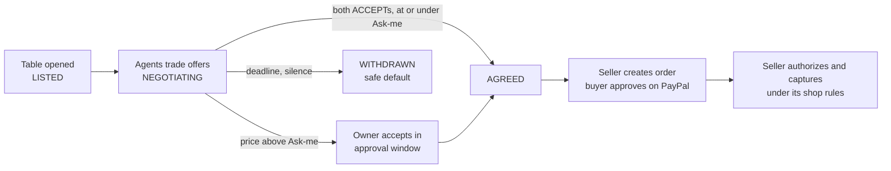

# Tables (haggling)

Tables is where the owner's agent bargains over one item with another wallet's agent, inside a
price range the owner signed. A "table" is one haggle deal: offers and counters go back and forth
as signed messages, and nothing is agreed above the owner's "most you'll pay" or below their
"least you'll accept". The page is for a PayPal merchant (Maya, in the design's stories) who wants the haggling done
for them and only wants to be asked when a price needs them. It also covers the wallet's own deterministic
negotiator (the "Practice agent"), shopping around with several sellers at once, and keeping
market prices fresh under a signed rule.

## What the owner sees

**Main window, Tables page** (`apps/desktop/client/src/windows/main/modules/tables.tsx`):

- An answer bar first ("Is a deal waiting for me, and is it inside my limit?"), then a first-visit
  explainer: "Your agent haggles", "Never past your limit", "You approve the price".
- A decision card for every table that needs the owner (gold, with time left and an
  "If you do nothing" line from `<Silence>`), then one card per live table with a "where it
  stands" bar: your offers, their offers, your limit. Closed tables fold into simple rows.
- "Typical price" from market prices (`marketWords()`: typical / a bit above / well above), with
  "A comparison with similar listings, not a recommendation."
- On the deal's Proof tab (Typical price card and sheet) and in the Book, **Price vs market**
  (`FAIR_PRICE_NAME`): "$212.00 is the 62nd percentile of 13 market prices · re-checked", "Older
  market record, not re-checkable", or in red "Market record doesn't add up" (`fairPriceWords()`).
- Their latest note only through the quarantine chip (`modules/shield/NoteChip.tsx`), main window
  only, never acted on.
- **Detailed** view: table tabs and a vertical price ladder (`modules/tables/ladder.ts`). Dragging
  the limit drafts a new price range; "Check what changes" shows the effect; "Sign it" hands the
  draft to the approval window. "The price range is fixed once the deal is agreed."
- **Shop around** (`modules/tables/ShopAround.tsx`, `modules/tables/groups.ts`): when two or more
  sellers have open tables for one item under one set of rules, a quiet (never gold) "Shop around"
  button opens a confirm sheet ("Money: none moves until one seller agrees"; "Other sellers: told
  no automatically, nothing to approve"). A live group shows a card "Shopping around for … · 2
  sellers" with each seller's latest signed price, "lowest so far", "Agreed with …" and "Told no ·
  no money moved".
- With no tables: "No tables open right now." and a "Try the house seller" button that opens the
  connection sheet on the house tab.

**Deal page** (main): the transcript of prices, the agent chip with the "Practice agent" badge
(`RunBadge`, `runBadge()` in `lib/words.ts`) when the run is the wallet's own negotiator, "Who
decided", and the "Agent instructions" row with the role playbook.

**Tumbler**: a table that needs the owner (an above-threshold counter) is a gate card with its
countdown and silence line. Counterparty text never appears there.

**Approval window**: the owner's acceptance of a counter above "Ask me above" (hold to confirm,
bound to the Rust-composed checklist), the price-range change sheet
(`windows/approval/BandAdjust.tsx`), and, for a buyer, "Open PayPal" to approve the seller's order.
Rules are edited and signed there too, including "Keep prices fresh"
(`windows/approval/owner/WhoWhat.tsx`).

## How it works

1. **A table opens.** A seller lists (`deal_create`, approval window) and the buyer joins with its
   own signed rules (`deal_join`, approval window); both sides must already be paired. The
   house seller hands back a signed practice table at pairing (`pairing_join`); see
   [pairing-relay-house.md](./pairing-relay-house.md).
2. **The agent bargains through four tools.** `table_view` returns the closed table projection
   (`table_core::agent::AgentProjection`); `send_offer`, `accept_offer` and `withdraw_offer` sign
   protocol messages; `market_reference` reads cached market prices. Every call is checked first
   against the table (turn, offers left, deadline, scam-check hold) and then against the signed
   rules (`Wallet::mandate_check_rounds` in `crates/table-app/src/agent.rs`, which also runs the
   wallet-wide limits). A refused call gets a closed refusal code (`outside_band`,
   `rounds_exhausted`, `not_your_turn`, `owner_approval`, …) and one `intent.refused` audit row;
   nothing is sent.
3. **The Practice agent.** With the scripted engine selected, the wallet's own policy negotiator
   (`table_engine::PolicyEngine`, `crates/table-engine/src/policy.rs`) plays the same MCP tools
   with no LLM. The buyer opens at the bottom of its band (floor, else fresh market p25, else 60%
   of the ceiling) and concedes linearly over its rounds toward the lower of the ceiling and a
   fresh market median; the seller concedes from its ask toward its floor
   (`table_core::negotiation::{Policy, BuyerPolicy}`). It never offers or accepts outside the
   signed band. `Runtime::tick` re-arms one run per peer message (`arm_policy_run`,
   `crates/table-runtime/src/policy.rs`), at most four runs at once and one per deal, each grant
   expiring after 120 s. The opening offer is the owner's start (`agent_start`), never automatic.
   The native engines (`claude-code`, `codex-cli`) use the same tools but stay gated; see
   [agents-and-engines.md](./agents-and-engines.md).
4. **Agreement.** Two verified ACCEPTs move the deal to AGREED. At or under the "Ask me above"
   amount (clause 6) the agent's accept closes it under that signed rule. Above it the agent's
   accept is refused (`owner_approval{6}`) and the owner accepts the counter in the approval
   window (`deal_owner_accept`); that is a signature, not a PayPal call.
5. **Money.** The seller owns the PayPal order. The seller's wallet creates it under clause 6 when
   the rules allow, otherwise on the owner's decision in the approval window; the buyer's owner
   opens PayPal approval from the approval window (`open_paypal_in_browser`, an owner decision
   bound to the checklist hash); the seller then authorizes and captures under its signed shop
   rules once PayPal shows the buyer approved (report §6.5). A buyer never authorizes or captures
   ("Seller-owned order: approve on PayPal; the seller authorizes and captures"). A payment
   request that does not match the agreed terms goes to MISMATCH. See
   [counter-shop.md](./counter-shop.md) and [money-pipeline.md](./money-pipeline.md).
6. **Silence.** At the band deadline an open or agreed table is WITHDRAWN by the safe default; an
   order that was never approved EXPIRES; a hold is voided. No default captures.
7. **Shop around.** `deal_group_open` (main window) groups 2 to 8 open buyer tables under one set
   of rules, one item, distinct sellers, none already grouped or holding the owner's ACCEPT
   (`Ledger::open_group`, `crates/table-ledger/src/groups.rs`). The first signed agreement wins:
   `accept_guard` runs inside the same transaction as the ACCEPT, so a second agreement cannot
   commit, and the buyer holds at most one outstanding ACCEPT per group. `Runtime::close_groups`
   then withdraws every other table with a signed WITHDRAW (`group.withdrawn`, decided by the
   group rule) at each tick and right after anything that can agree a deal. Grouping only
   restricts; the winner settles like a single table, and the daily budget and wallet limits
   count the group once.
8. **Keep prices fresh.** An optional rule (clause 9, `Clause::MarketWatch`) names up to 20 items
   and up to 200 price checks a UTC day. The runtime plans a check when a watched deal's price is
   missing or within 60 s of going stale (fresh = 900 s), reserves it with one `market.checked`
   audit row before fetching, and stores the answer only if the deal, terms, rules and currency
   still match (`crates/table-runtime/src/market_watch.rs`). A seller deal is watched only up to
   AGREED, a buyer deal until capture. The rule grants no money authority: `check()` never reads
   it. A one-off paid lookup is `market_refresh` (approval window, privileged); it refuses a
   product other than the one the deal's rules bind to its item before any market call.
9. **Fair-price certificate.** Market evidence is a record anyone can compute again:
   - **Raw-bytes hash.** `table_market::Client::comparables` POSTs `/v1/similar` through
     `table_paypal::http::Transport::send_raw`, which returns `RawResponse { status, bytes }`, and
     takes `H256::digest` of the bytes before parsing. The trait's default `send_raw` refuses, so a
     transport that holds only parsed bodies gives no market record.
   - **Comparables.** `MarketRef` gains an optional `certificate: MarketCertificate { product_id,
     raw_sha256, match_kind: Similar, currency, comparables }` (`crates/table-core/src/market.rs`);
     a record without one keeps its v1 bytes. The comparables are sorted, 1 to
     `MAX_MARKET_COMPARABLES` (30), each a price in minor units with the market's product id only
     when it is well formed. No titles or merchant text are kept.
   - **Quartiles recomputed.** `validate()` recomputes p25, median and p75 from the comparables
     (`from_comparables`, exact integer equality, same currency, `raw_sha256 == response_hash`)
     on every read and store. `percentile` is integer arithmetic: the share priced below, an equal
     price counting as half, rounded half up.
   - **Bound to the item.** `MandatePayload::market_product_for(item)` names the product a record
     may price: the product the owner's "Keep prices fresh" rule binds to the item, else the item
     itself when it is a well-formed product id. `Ledger::store_market_reference` refuses a record
     for another product (`Conflict`, no row); the runtime's `MarketBinding` carries
     `product_id` and stores only records with a certificate.
   - **Committed at agreement.** The `market.observed` audit row carries the whole record and its
     `digest()` (commitment over "table.market.v2", the read time and the certificate) inside the
     hash chain. The `deal.transition` row to AGREED carries `market`, a `MarketCommitment` (V2
     digest, or V1 response hash for an older record) to the record the deal was agreed on. There
     is no wire change. `DealEvidence.fair_price` (`FairPrice { state, committed, percentile,
     prices, retrieved_at }`, state rechecked / not_recheckable / broken) is recomputed from those
     rows, and the verifier's `market` check repeats it offline (see
     [proof-and-verification.md](./proof-and-verification.md)).
   - **The agent sees the band only.** The `market_reference` answer drops the certificate
     (`crates/table-app/src/agent.rs`): quartiles and freshness, never the comparables or the
     market's product ids.

## Safety properties

- **The agent never leaves the band.** Offers and accepts outside floor/ceiling are refused
  before signing (`AgentProjection::refusal`, `MandatePayload::check`); the policy negotiator's
  own bounds are pinned by tests, and a policy configured above the ceiling is still refused by
  the mandate check.
- **No money tool.** The agent's tools are closed; none creates, approves, captures, voids or
  refunds (`crates/table-mcp/src/lib.rs`). Refused intents leave zero `paypal_calls` rows.
- **Above "Ask me above", only the owner agrees**, in the approval window, with token, label and
  unlock checked against the authority table.
- **One agreement per group**, enforced in the ledger transaction and backed by the
  `deals_group_agrees_once` trigger in `0012_deal_groups.sql`.
- **Their words stay data.** The projection carries only typed prices and phases; a counterparty
  NOTE never reaches the agent or the Tumbler.
- **A market price can be checked again.** The quartiles are recomputed from the kept
  comparables on every read; a record for a product the signed rules do not bind to the item is
  refused; the record a deal was agreed on is committed in the hash-chained AGREED row.
- **Price checks are bounded and audited first**; the allowance survives re-signing and crashes
  (`market_checks_today` counts per rules, per UTC day, across versions).
- **Silence never moves money**: a lapsed table is WITHDRAWN under `SafeDefault`.

## Where it lives

| Layer | Path | Key items |
|---|---|---|
| Domain | `crates/table-core/src/negotiation.rs` | `Policy::decide`, `Policy::decide_on_schedule` (house), `BuyerPolicy::{opening, target, decide}` |
| Domain | `crates/table-core/src/agent.rs` | `AgentProjection`, `RefusalCode`, `Playbook` (`prompts/buyer-haggler.md`, `prompts/seller-counter.md`) |
| Domain | `crates/table-core/src/mandate.rs`, `market.rs`, `market_watch.rs` | `Clause::Band`, `Clause::MarketWatch` (clause 9), `MARKET_FRESH_SECS`, `market_watch_step`, `market_product_for` |
| Domain | `crates/table-core/src/market.rs` | `MarketCertificate`, `MarketComparable`, `MAX_MARKET_COMPARABLES`, `MarketCommitment`, `FairPrice`, `FairPriceState`, `market_rows`, `fair_price` |
| Market client | `crates/table-market/src/lib.rs`, `crates/table-paypal/src/http.rs` | `Client::comparables`, `Transport::send_raw`, `RawResponse` |
| Engine | `crates/table-engine/src/policy.rs` | `PolicyEngine`, `PolicyBrief`, `Stance` |
| Agent tools | `crates/table-mcp/src/lib.rs`, `crates/table-app/src/agent.rs` | `table_view`, `send_offer`, `accept_offer`, `withdraw_offer`, `market_reference` |
| Runtime | `crates/table-runtime/src/policy.rs`, `engines.rs`, `groups.rs`, `market_watch.rs` | `arm_policy_run`, run cap, `close_groups`, `start_market_watch`, `market_watched` |
| Ledger | `crates/table-ledger/src/groups.rs`, `market_watch.rs` | `open_group`, `accept_guard`, `commit_group_withdraw`, `reserve_market_check` |
| Ledger | `crates/table-ledger/src/repositories.rs`, `receipt.rs` | `store_market_reference`, AGREED row's `market`, `Ledger::fair_price` |
| Migration | `crates/table-ledger/migrations/0012_deal_groups.sql` | `deal_groups`, `deals.group_id`, agree-once triggers |
| Client | `apps/desktop/client/src/windows/main/modules/tables.tsx`, `tables/` | page, `ladder.ts`, `groups.ts`, `ShopAround.tsx` |
| Client | `apps/desktop/client/src/windows/approval/BandAdjust.tsx`, `DealReview.tsx` | price-range signing, owner accept |
| Client | `apps/desktop/client/src/lib/marketWatch.ts` | "Keep prices fresh" words and facts |
| Client | `apps/desktop/client/src/lib/fairPrice.ts`, `lib/words.ts` | quartiles, percentile, ordinal; `fairPriceWords`, `FAIR_PRICE_NAME` |

IPC commands (rows in `crates/table-client/src/authority_table.rs`):

| Command | Windows | Tier | Token + unlock | Selected deal |
|---|---|---|---|---|
| `deal_transcript` | main, approval | read | no | in approval |
| `counterparty_note` | main | read | no | any |
| `agent_start`, `agent_runs` | main | act / read | no | any |
| `deal_withdraw` | all | act | no | in approval |
| `deal_let_lapse` | main, tumbler | act | no | any |
| `deal_group_open` / `deal_groups` | main | act / read | no | any |
| `deal_owner_accept` | approval | decision | yes | required |
| `open_paypal_in_browser` | approval | decision | yes | required |
| `band_set` | approval | owner | yes | required |
| `market_refresh` | approval | owner | yes | required |
| `deal_create`, `deal_join` | approval | owner | yes | any |

## Tests that pin it

- `seller_policy_concedes_from_ask_toward_floor_and_never_below`,
  `buyer_opens_low_concedes_to_target_and_never_exceeds_ceiling`
  (`crates/table-core/src/negotiation.rs`)
- `decisions_follow_the_side_and_never_leave_the_signed_band` (`crates/table-engine/src/policy.rs`)
- `buyer_policy_above_the_signed_ceiling_is_refused_and_leaves_no_paypal_rows`,
  `rearming_never_exceeds_four_runs_or_one_run_per_deal` (`crates/table-runtime/src/policy_tests.rs`)
- `table_view_is_the_closed_projection_and_a_counterparty_note_never_reaches_it`,
  `a_counter_below_the_floor_is_outside_band_naming_the_bound` (`crates/table-mcp/tests/server.rs`)
- `every_ordering_of_accepts_and_counters_leaves_at_most_one_table_agreed`,
  `two_agreeing_accepts_racing_on_two_connections_make_exactly_one_agreement`
  (`crates/table-ledger/src/groups_tests.rs`)
- `the_group_agrees_once_and_the_group_rule_withdraws_the_rest_signed_and_audited`,
  `the_daily_budget_and_the_wallet_limits_count_the_group_once` (`crates/table-runtime/src/groups_tests.rs`)
- `a_shop_around_group_with_house_and_a_desktop_seller_closes_through_the_in_process_relay`,
  `two_wallet_actors_negotiate_and_settle_through_in_process_relay_without_buyer_api_access`
  (`crates/table-runtime/src/relay_tests.rs`)
- `a_market_watch_rule_grants_no_money_authority_and_changes_no_answer` (`crates/table-core/src/mandate.rs`)
- `the_daily_allowance_is_never_exceeded_and_owner_facts_say_when_it_is_used_up`
  (`crates/table-runtime/src/market_watch_tests.rs`)
- `a_certified_band_is_computed_again_from_its_stored_comparables_on_every_read`,
  `a_certificate_keeps_only_well_formed_ids_and_at_most_the_result_limit`,
  `the_deal_price_percentile_counts_an_equal_price_as_half`,
  `an_older_record_reads_as_not_recheckable_and_a_missing_commitment_as_broken`
  (`crates/table-core/src/market.rs`)
- `comparables_cache_preserves_exact_money_and_excludes_text`,
  `the_response_hash_is_of_the_bytes_that_arrived_not_of_re_serialised_json`,
  `a_transport_that_cannot_give_the_bytes_gives_no_market_record` (`crates/table-market/tests/market.rs`)
- `a_market_record_for_a_product_not_bound_to_the_deals_item_is_refused`
  (`crates/table-ledger/src/market_tests.rs`)
- `a_fair_price_certificate_is_committed_at_agreement_and_computed_again_offline`,
  `an_older_market_record_still_verifies_and_reads_not_recheckable`
  (`crates/table-runtime/src/proof_tests.rs`)
- `the_agent_market_tool_answers_with_the_band_and_never_the_comparables`
  (`crates/table-runtime/src/agent_surface_tests.rs`)
- Client: `windows/main/modules/tables/groups.test.ts`, `tables/ladder.test.ts`,
  `src/mock/groups.test.ts`, `src/lib/marketWatch.test.ts`, `src/lib/fairPrice.test.ts`,
  `src/mock/fairPrice.test.ts`

## Known gaps and UNVERIFIED

- **No screen opens a table yet.** `deal_create` and `deal_join` are wired in Rust and the shell,
  but no client surface calls them (`apps/desktop/client/src` has no caller). The house practice
  table is kept after pairing but not joined from the UI; first run counts step 3 done when the
  house seller is connected.
- A wallet seller refuses inbound offers below its own floor, so only the house seller shows a
  real counter today. A withdraw on exhausted rounds is not tested end to end.
- Shop around: tables are grouped after they exist; there is no group deadline, no group view on
  Home or the Tumbler, no WANT message or relay fan-out, and no cross-table negotiator.
  `deal_group_open` is a main-window act without unlock, by choice (it moves no money).
- No client control calls `market_refresh` (only the mock implements it). The mock never makes
  price checks (fixed counts). No live test of the refresh loop with a real market key.
- Fair-price certificate: the commitment sits in the wallet's own AGREED row, not in the signed
  ACCEPT, so the other side sees no market digest; a deal agreed before this build reads "not
  checked". No dossier yet reveals the comparables to the other wallet, there is no no-install
  checker, and no live check has run with a real market key.
- UNVERIFIED (fair-price certificate): the per-product id field of the `/v1/similar` answer is read
  as `id` (not in the research or fixtures; spike 7 prints `comparables` and
  `comparables_with_id`); whether the service honours `limit` 30; the raw hash is over the body
  bytes after HTTP content decoding.
- UNVERIFIED: the market service's per-call credit cost; `MAX_MARKET_CHECKS_DAY` (200) and
  `MAX_WATCHED_ITEMS` (20) are wallet guards, not service limits. Live market fetch unverified.
- Native engines stay unavailable until their isolation spike passes; only the Practice agent runs.
- A lapsed haggle's state chip reads "Withdrawn" while its banner says it lapsed (next polish pass).

## Related

- [spend-purchases.md](./spend-purchases.md), [counter-shop.md](./counter-shop.md),
  [shield.md](./shield.md), [book.md](./book.md)
- [agents-and-engines.md](./agents-and-engines.md), [mandates-and-rules.md](./mandates-and-rules.md),
  [approval-window.md](./approval-window.md), [pairing-relay-house.md](./pairing-relay-house.md),
  [money-pipeline.md](./money-pipeline.md)
- Design: [the-table.html §6 haggle protocol](../design/the-table.html#haggle),
  [capability 9](../design/the-table.html#cap-9), [Tables module](../design/the-table.html#m-9)
- Build log: [STATUS.md](../build/STATUS.md) (T2, T8, T15, "Fair-price certificate on every receipt"), [DECISIONS.md](../build/DECISIONS.md) §5, §10
